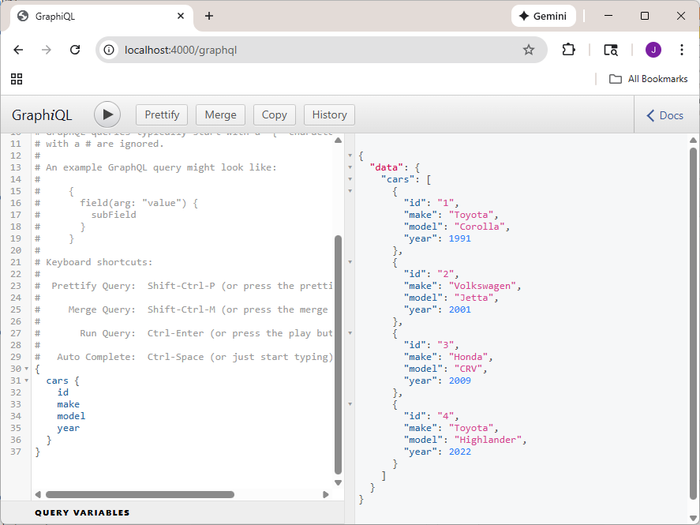

# Welcome to GraphQL demo

This is a simple demo of graphql in node.js. A little express server is running to host graphql. A schema of "car" is set up, along with query and mutation to search and update.

Assuming you have node installed, in a new directory.
Start a new project, install the needed dependencies

```
npm init -y
npm install express express-graphql graphql
```
Download server.js and launch ```node server.js```

Then open browser and point to http://localhost:4000/graphql



To query for all cars (and fields within)
```
{
  cars {
    id
    make
    model
    year
  }
}
```
To query for a specific car
```
{
  car(id: "1") {
    make
    model
  }
}
```
To do a custom query
```
{
  searchCars(query: "Toyota") {
    id
    year
    make
    model
  }
}
```
To add car (with a 'mutation')
```
mutation {
  addCar(input: {
    make: "Tesla"
    model: "Model 3"
    year: 2025
  }) {
    id
    make
    model
  }
}
```
To delete car
```
mutation {
  deleteCar(id: "2")
}
```
To update car
```
mutation {
  updateCar(
    id: "1"
    input: { year: 1992 }
  ) {
    make
    model
    year
  }
}
```